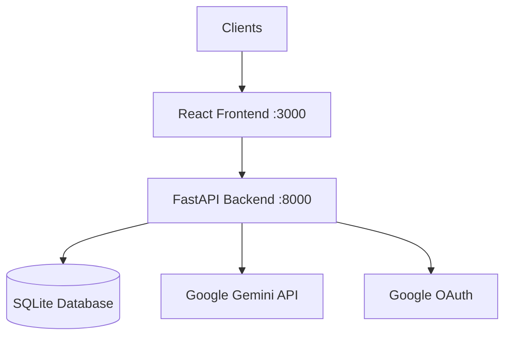

<h1 align="center">lyrnios.ai - AI-Powered Educational Assistant</h1>

<div align="center">
  <p>An intelligent educational assistant that generates personalized learning content with interactive visualizations, code examples, and comprehensive study materials.</p>
  <p><strong><a href="#-features">Features</a> • <a href="#-quick-start">Installation</a> • <a href="#-usage">Usage</a> • <a href="#️-architecture">Architecture</a> • <a href="#-contributing">Contributing</a></strong></p>
</div>

---

## 📚 Features

### Core Capabilities
- **Intelligent Content Generation:** Uses Google’s Gemini AI to create structured, detailed educational content.
- **Multi-Modal Learning:** Combines text, diagrams, graphs, and code examples.
- **Interactive Visualizations:** Renders dynamic Mermaid diagrams and mathematical equations.
- **Progressive Content Reveal:** Smooth section-by-section presentation.
- **Text-to-Speech Integration:** Built-in narration using Puter.js.
- **Personalized Study Plans:** Custom learning roadmaps.

### New Features (v2.0)
- **🔐 Google Authentication:** Secure sign-in with Google OAuth.
- **💬 Chat History:** Persistent conversation history stored in database.
- **💾 Session Management:** Resume past learning sessions anytime.
- **📱 Dedicated Login Page:** Beautiful glassmorphism login interface.

### Technical Features
- **Dual API Modes:**
  - `demo` – Preloaded examples for testing.
  - `generate` – Live AI content generation.
- **Responsive Design:** GitHub-inspired UI with glassmorphism.
- **Real-time Chat Interface:** Conversational learning experience.
- **Syntax Highlighting:** Multi-language code display.
- **LaTeX Rendering:** Math support via KaTeX.

---

## 🚀 Quick Start

### Prerequisites
- Python 3.8+
- Node.js 16+
- Google Gemini API Key
- Google Cloud Console Project (for OAuth)

### Installation

**Clone the repository**
```bash
git clone https://github.com/0xIIEST/lyrnios.ai.git
cd lyrnios.ai
```

**Backend Setup**
```bash
cd backend
python -m venv venv
source venv/bin/activate  # Windows: venv\Scripts\activate
pip install -r requirements.txt
cp .env.example .env
```

**Configure Environment (.env)**
You need to set up a project in [Google Cloud Console](https://console.cloud.google.com/) for OAuth.
```ini
# Gemini AI
API_KEYS="your_gemini_api_key_1,your_gemini_api_key_2"

# Google OAuth
GOOGLE_CLIENT_ID="your_google_client_id"
GOOGLE_CLIENT_SECRET="your_google_client_secret"
SECRET_KEY="your_random_secret_key"
FRONTEND_URL="http://localhost:3000"
```

**Frontend Setup**
```bash
cd frontend
npm install
npm run dev
```

**Run the Application**
```bash
# Terminal 1 (Backend)
cd backend
make dev  # or uvicorn app:app --reload --port 8000

# Terminal 2 (Frontend)
cd frontend
npm run dev
```
Visit **http://localhost:3000** causing a redirect to the login page.

---

## 🎯 Usage

### Basic Flow
1. **Sign in** with your Google account.
2. Enter a topic or question in the input bar on the landing page.
3. Watch content reveal progressively.
4. Access **Chat History** via the sidebar (click the 💬 icon).

### Sections
- **Foundations** – Core prerequisites  
- **Core Concepts** – Detailed explanations  
- **Formulas** – Mathematical equations  
- **Key Concepts** – Summaries  
- **Practice Problems** – Exercises  
- **Study Plan** – Structured roadmap  
- **Diagrams** – Visuals  
- **Code Examples** – Practical snippets  

### Interactions
- 🔊 Click speaker icon for narration  
- Zoom/pan diagrams  
- Explore **Further Questions**

---

## 🧩 API Endpoints

| Method | Path | Description | Auth Required |
|--------|------|-------------|---------------|
| `GET` | `/auth/google` | Initiate OAuth login | No |
| `GET` | `/sessions` | List user sessions | Yes |
| `POST` | `/sessions` | Create new session | Yes |
| `GET` | `/sessions/{id}` | Get session details | Yes |
| `POST` | `/generate` | Generate AI content | Yes |

---

## 🏗️ Architecture

### Overview


### Stack
#### Frontend
React, React Router, Tailwind, Mermaid, KaTeX, Axios, Framer Motion, React Markdown, Puter.js

#### Backend
FastAPI, Uvicorn, Google Gemini API, Authlib (OAuth), SQLAlchemy, SQLite, Pydantic

### Structure
```
lyrnios-ai/
├── backend/
│   ├── app.py           # API Routes
│   ├── auth.py          # OAuth & JWT logic
│   ├── database.py      # DB Models & CRUD
│   ├── ai.py            # Gemini Wrapper
│   └── lyrnios_auth.db  # SQLite Database
│
├── frontend/
│   ├── src/
│   │   ├── components/
│   │   │   ├── Login.jsx
│   │   │   ├── ChatHistory.jsx
│   │   │   └── Session.jsx
│   │   ├── context/
│   │   │   └── AuthContext.jsx
│   └── index.css
└── README.md
```

---

## 🔧 Configuration

### Backend
**API Key Rotation**
```bash
API_KEYS=key1,key2,key3
```

**Model Parameters**
```python
model = "gemini-2.0-flash"
temperature = 0.3
max_output_tokens = 8192
```

**Styling**
Edit `frontend/src/colors.css` to adjust theme.

---

## 🤝 Contributing

1. Fork the repo  
2. Create a branch: `git checkout -b feature/new-feature`  
3. Commit: `git commit -m "Add new feature"`  
4. Push: `git push origin feature/new-feature`  
5. Submit a PR

---

## 📝 License
Licensed under **GNU GPL v3**.  
Free to use, modify, and distribute with attribution.  
See [LICENSE](LICENSE) for details.

---

## 🙏 Acknowledgments
- Google Gemini AI  
- Mermaid  
- KaTeX  
- Puter.js  
- React Community

---

## 🗺️ Roadmap
- [x] User authentication (Google OAuth)
- [x] Save/resume sessions (SQLite)
- [x] Chat History UI
- [ ] PDF export  
- [ ] Mobile app  
- [ ] Video generation (important)
<br/>

<div align="center">


</div>

<br/>

<div align="center">
  <strong>Made with ❤️ by the 0xIIEST team</strong><br/>
</div>

<br/>

<table align="center">
	<tr align="center" style="font-weight:bold">
		<td>
		Angad Basandrai
		<p align="center">
			
		</p>
			<p align="center">
				<a href = "https://github.com/AngadBasandrai">
					
				</a>
			</p>
		</td>
				<td>
		Sagnik Bhattacharjee
		<p align="center">
			
		</p>
			<p align="center">
				<a href = "https://github.com/datavorous">
					
				</a>
			</p>
		</td>
    <td>
		Yashvardhan Rai
		<p align="center">
			
		</p>
			<p align="center">
				<a href = "https://github.com/TiElixir">
					
				</a>
			</p>
		</td>
        <td>
		Abhinaba Chowdhury
		<p align="center">
			
		</p>
			<p align="center">
				<a href = "https://github.com/PhasorM">
					
				</a>
			</p>
		</td>
	</tr>
</table>
